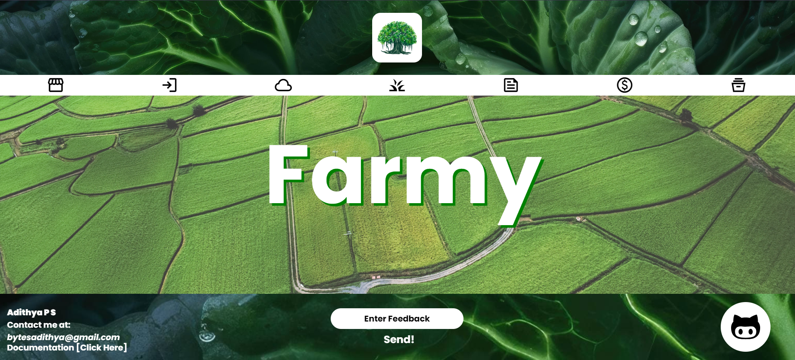

# Farmy

**Farmy** is a comprehensive web application designed for managing various aspects of farming and agriculture. Built using React and Supabase, this tool offers a suite of features including:

- **Transaction Detail Saver**: Keep track of financial transactions with ease.
- **Document Locker**: Securely store and manage important documents.
- **Horticulture Search**: Find detailed information on horticultural topics.
- **News**: Stay updated with the latest news relevant to farming and agriculture.
- **Weather**: Get real-time weather updates to help with farming decisions.

## Features

- **Transaction Detail Saver**: Log and review financial transactions.
- **Document Locker**: Encrypt and manage documents for secure access.
- **Horticulture Search**: Search and retrieve information on various horticultural topics.
- **News**: Access up-to-date news articles and reports.
- **Weather**: Check current weather conditions and forecasts.

## Installation

To get started with Farmy, follow these steps:

1. **Install Dependencies**
  
2. **Clone the Repository**
   ```bash
   git clone https://github.com/adithya1770/farmy.git



